# Viora — Database Design (DESIGN ONLY, not yet applied)

> **Status: DRAFT for review.** Nothing in this document has been applied to any Supabase
> project. No migration, RLS policy, or RPC here has been executed. Per CLAUDE.md §6.9, RLS
> policies get a separate reviewed draft (`docs/rls-policies-draft.md`) before `apply_migration`
> is ever called, and per §6 every apply targets **Viora's own Supabase project only** — its ref
> must be confirmed (`.claude/viora-project-ref.txt`) before any write.

Source of truth for every column/type below: the 13 files in `docs/features/*.md`, which were
extracted from the FlutterFlow-generated frontend Row classes (`lib/backend/supabase/database/
tables/`). Nothing here invents a column the frontend doesn't already read/write — gaps are
flagged in Open Decisions instead of guessed.

## Document map (kept under 400 lines each — CLAUDE.md §5)
| File | Contents |
|---|---|
| `docs/database/01-tables-auth-identity.md` | `user`, `user_roles`, `public_user_profile`, `user_login`, `user_devices`, `user_locations` |
| `docs/database/02-tables-posts-comments.md` | `post`, `post_images`, `post_like`, `post_share`, `tag`, `see_post_access`, `comment_post_access`, `post_comment`, `post_comment_likes` |
| `docs/database/03-tables-community-groups.md` | `follows`, `group`, `group_admin`, `group_members`, `group_members_invite`, `group_user_status` (no `community` table — see Decision: Remove Community Concept below) |
| `docs/database/04-tables-events-marketplace.md` | `event_page`, `event_attending`, `sale`, `sale_category`, `sale_images` |
| `docs/database/05-tables-business-chat.md` | `business_page`, `business_promote`, `business_promote_plans`, `business_contacted`, `chat`, `chat_users`, `messages` |
| `docs/database/06-tables-notifications-search-moderation.md` | `notifications`, `admin_notification`, `search_history`, `reports`, `blocks`, `audit_log` (new) |
| `docs/database/07-storage-buckets.md` | All storage buckets, mime/size limits, public/private, path/RLS intent |
| `docs/database/08-triggers-counters.md` | Denormalized counters, trigger recommendations, partitioning/pagination notes |
| `docs/database/09-rpc-inventory.md` | Full RPC list per feature: name, args, returns, INVOKER/DEFINER, validations |
| `docs/database/10-open-decisions.md` | Every open decision, naming conflict first, quirks list, gaps |

## 1. Overview & conventions
- **Naming:** snake_case for all new objects. The frontend's existing FlutterFlow-generated table
  names are kept **verbatim** as the authoritative schema (see Naming Decision below) — including
  documented quirks (`IsOwner`, `isdeleted`, `logitude`, `Address`). Every quirk is listed, not
  silently fixed, in `docs/database/10-open-decisions.md`.
- **Every table:** `id` PK (`uuid default gen_random_uuid()` unless the frontend types it as
  `int8`/`int4`), `created_at timestamptz not null default now()`, `updated_at timestamptz` only
  where the frontend actually updates rows (per-table, noted individually).
- **FKs:** always real `references` constraints with an explicit `on delete` — `cascade` where the
  child is meaningless without the parent (e.g. `post_images → post`), `set null` where the row
  should outlive the parent (e.g. `notifications.post_id` when a post is later hard-deleted — not
  expected in practice since posts soft-delete, but the FK is defensive).
- **Indexes:** every FK column indexed; every filter/sort/join column used by a listed RPC or
  direct query is indexed; composite indexes match the exact filter tuples the feature docs show.
- **RLS:** mandatory on every `public.*` table (CLAUDE.md §6.1), default deny, admin-only writes
  by default, user-facing writes via RPC. Helper predicates wrapped `(SELECT helper())`. RLS
  **intent** only here — the reviewed policy SQL draft is a separate deliverable
  (`docs/rls-policies-draft.md`) before `apply_migration`.
- **`"user"` is a SQL keyword.** Every reference to the `user` table must be double-quoted
  (`public."user"`) in raw SQL; PostgREST/Supabase client access is unaffected (table names don't
  need quoting there). Flagged again in Open Decisions since it trips up hand-written migrations.
- **No community concept (RESOLVED — Decision: Remove Community Concept, `10-open-decisions.md`).**
  There is no `community` table and no community-scoped RLS/RPC logic anywhere in this design.
  Wherever the locked FlutterFlow frontend's Row class still has a `community_id` column (it
  hardcodes `= 1` today), that column is **kept as a vestigial compat column**: plain `int8`,
  `DEFAULT 1`, nullable, **no FK**, never used in an RLS predicate or an RPC's WHERE clause. It is
  removed everywhere the frontend Row class doesn't have it. See each `docs/database/0N-*.md` file
  for the per-table annotation and `09-rpc-inventory.md` for the per-RPC compat-arg notes.
- **Identity table RLS (RESOLVED — Decision: Identity RLS, `10-open-decisions.md`).** The private
  `"user"` table is owner-only: SELECT/UPDATE gated by `id = (SELECT auth.uid())`, no cross-user
  reads at all. `public_user_profile` is the public-facing profile — readable by any authenticated
  user, owner-only writes — and is the **primary read surface** the app actually uses for
  profile/display data. See `docs/database/01-tables-auth-identity.md`.
- **Video is out of scope (RESOLVED — Decision: Video Out of Scope, `10-open-decisions.md`).** No
  `post-videos` bucket, no video mime types, images only. The app has no video-upload UI today.

## 2. Extensions required
| Extension | Why |
|---|---|
| `pgcrypto` | `gen_random_uuid()` for every uuid PK/default. |
| `postgis` | `user_locations.location`, `sale.location_point`, `event_page.location` — all geo points; required by `get_followers_nearby`, sale distance filter (kms), and event location. |
| `pg_trgm` | Trigram GIN indexes for `ILIKE`-style search (`get_search_all_data`, `tag_search` on `public_user_profile.name`) — see `09-rpc-inventory.md`. |
| `unaccent` (optional) | Improves name search if accented characters are expected; flagged, not mandatory. |

## 3. Enums
Only value sets that are **confirmed** by the feature docs are modeled as Postgres `ENUM`s.
Value sets that are inferred/incomplete stay `text` (+ a `CHECK` once confirmed) — see
`10-open-decisions.md` for every unconfirmed set (e.g. `e_discoverability`, `e_group_role`,
`report_type`, `promotion_status` derivation).

| Enum | Values | Used by |
|---|---|---|
| `app_role` | `'user'`, `'admin'` | `user_roles.role` — **per explicit user requirement**, overriding the frontend's literal `'customer'` insert (see Naming/Role conflict below). |
| `lifecycle_status` | `'active'`, `'removed'`, `'suspended'` | `post.post_status`, `"group".status`, `event_page.event_status`, `business_page.business_status` (frontend's shared Dart `Status` enum). |
| `e_group_type` | `'open'`, `'private'` | `"group".e_group_type`. |
| `e_message_type` | `'text'`, `'image'` | `messages.e_message_type`. |
| `e_price_type` | `'Free'`, `'Fixed'` | `sale.e_price_type` (exact case from frontend radio). |
| `e_sale_type` | `'selling'`, `'sold'` | `sale.e_sale_type`. |
| `event_type` | `'Online'`, `'Offline'` | `event_page.event_type` (frontend radio; kept as enum for a CHECK — frontend doesn't send other values). |

## 4. Role / JWT model (CLAUDE.md §6.7 + user requirement)
- `user_roles` holds **exactly one role per user**: `role app_role not null default 'user'`.
- `public.custom_access_token_hook(event jsonb) returns jsonb` (Postgres Auth Hook, `SECURITY
  DEFINER`, `search_path = public, pg_temp`) reads `user_roles.role` for the authenticating user
  and injects it into `event -> 'claims' -> 'app_metadata' -> 'role'`.
- Every RLS admin predicate reads `(auth.jwt() -> 'app_metadata' ->> 'role') = 'admin'`, wrapped in
  a `STABLE SECURITY INVOKER` helper `public.is_admin()` called as `(SELECT public.is_admin())`.
- **Conflict flagged:** the frontend signup flow inserts `user_roles` with `role: 'customer'`
  (hardcoded) directly from the client. Since the user's requirement pins the role set to exactly
  `user`/`admin`, and CLAUDE.md §6 already requires `user_roles` writes to be admin/RPC-only, the
  rebuild's `signup_finalize` RPC (not the client) inserts the row and **always** sets
  `role = 'user'`, ignoring whatever the client sends. Full writeup in `10-open-decisions.md` §1.

## 5. Relationships (mermaid ERD — core cardinalities only)

```mermaid
erDiagram
  "user" ||--|| public_user_profile : "id = id"
  "user" ||--|| user_roles : "id = id"
  "user" ||--o{ user_devices : "user_id"
  "user" ||--o| user_locations : "id = user id"
  "user" ||--o{ post : "user_id (author)"
  post ||--o{ post_images : post_id
  post ||--o{ post_like : post_id
  post ||--o{ post_share : post_id
  post ||--o{ tag : post_id
  post ||--o{ post_comment : post_id
  post_comment ||--o{ post_comment: "parent_comment_id (self)"
  post_comment ||--o{ post_comment_likes : comment_id
  see_post_access ||--o{ post : see_post_access_id
  comment_post_access ||--o{ post : comment_post_access_id
  "user" ||--o{ follows : "follower_id / following_id"
  "group" ||--o{ group_admin : group_id
  "group" ||--o{ group_members : group_id
  "group" ||--o{ group_members_invite : group_id
  "group" ||--o{ group_user_status : group_id
  event_page ||--o{ event_attending : event_id
  sale ||--o{ sale_images : sale_id
  sale_category ||--o{ sale : "sale_category (by name)"
  business_page ||--o{ business_promote : business_page_id
  business_promote_plans ||--o{ business_promote : business_promote_plans
  business_page ||--o{ business_contacted : business_page_id
  chat ||--o{ chat_users : chat_id
  chat ||--o{ messages : chat_id
  "user" ||--o{ notifications : "sender_id / receiver_id"
  "user" ||--o{ reports : "reported_by_user / reported_user"
  "user" ||--o{ blocks : "blocker_id / blocked_id"
  "user" ||--o{ search_history : searched_by
```

Full per-table FK lists (with exact `on delete` behavior) are in the `docs/database/0N-*.md` files.

## 6. Storage buckets, triggers, RPCs, open decisions
See `docs/database/07-storage-buckets.md`, `08-triggers-counters.md`, `09-rpc-inventory.md`,
`10-open-decisions.md`. Summary counts: **9 buckets, images only** (no video bucket — RESOLVED,
see Decision: Video Out of Scope), see file for detail; **~20 recommended triggers** to replace
client-maintained counters; **~70 RPCs** across 13 features; **naming conflict is Open Decision
#1**; **community concept removed** (RESOLVED, see Decision: Remove Community Concept).

## 7. Migration ordering plan
Short, transactional migrations, applied in this order (each step is one or a few migrations):
1. Extensions (`pgcrypto`, `postgis`, `pg_trgm`).
2. Enums (§3) + `public.is_admin()` / role helper functions.
3. `"user"` (FK → `auth.users`), `user_roles`, `public_user_profile`, `user_login`, `user_devices`,
   `user_locations` (auth/identity — everything else depends on `user`).
4. `custom_access_token_hook` wired in Auth config (needs `user_roles` to exist).
5. `see_post_access`, `comment_post_access`, `sale_category`, `business_promote_plans` (lookup
   tables — no user-row deps).
6. `follows`, `blocks` (depend on `user` only — no community dependency).
7. `post`, `post_images`, `post_like`, `post_share`, `tag`, `post_comment`, `post_comment_likes`.
8. `"group"`, `group_admin`, `group_members`, `group_members_invite`, `group_user_status`.
9. `event_page`, `event_attending`.
10. `sale`, `sale_images`.
11. `business_page`, `business_promote`, `business_contacted`.
12. `chat`, `chat_users`, `messages`.
13. `notifications`, `admin_notification`, `search_history`, `reports`, `audit_log`.
14. Storage buckets + bucket policies (images only — no video, see Decision: Video Out of Scope).
15. Triggers (counters, `updated_at`, notification producers) — after all target tables exist.
16. RPC/PL-pgSQL functions (per `09-rpc-inventory.md`) — after all tables/triggers exist. Every
    RPC that accepts a `community_id`/`p_communityid` arg from the locked frontend keeps that
    param in its signature but never uses it for scoping (see `09-rpc-inventory.md` header note).
17. RLS: enable + policies, **only after** the separate `docs/rls-policies-draft.md` review.
18. Realtime publication/Broadcast authorization policies on `realtime.messages`.
19. Seed data: lookup rows (`see_post_access`, `comment_post_access`, initial `sale_category`
    rows — value sets to confirm, see Open Decisions). No `community` seed row — table doesn't
    exist.

**No `community` table step** — removed entirely per Decision: Remove Community Concept. Every
step above is renumbered from the prior draft accordingly.

Each numbered step above should be its own short migration file so the rebuild can be replayed
from zero per CLAUDE.md §6 schema rules.
